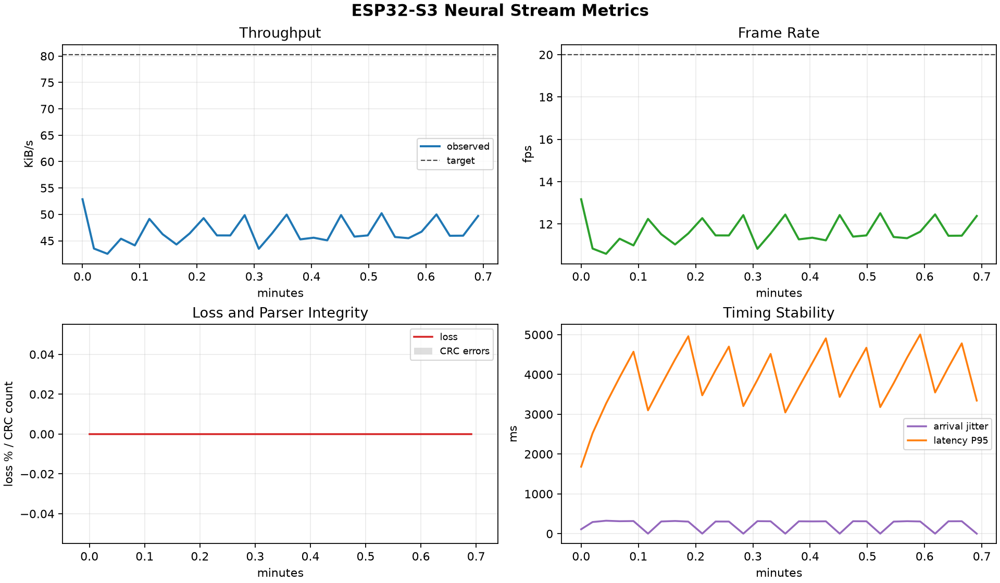
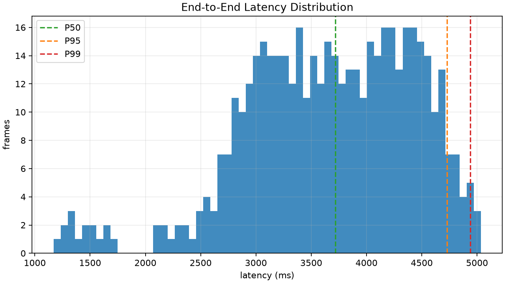

# ESP32-S3 Neural Stream Bandwidth Experiment Report

Generated at: `2026-08-01T03:07:04.011501+00:00`

## Experiment Context

This report summarizes an ESP32-S3 WiFi/TCP stream used as a neural-data surrogate for downstream spike-sorting and compression experiments. The main engineering question is whether the wireless link can sustain the configured stream rate while keeping application frame loss, parser errors, jitter, and end-to-end latency within an acceptable range.

## Key Results

| Metric | Value |
| --- | ---: |
| Time filter | last 0.8 minutes |
| Capture start UTC | 2026-08-01T03:06:14.142435+00:00 |
| Capture end UTC | 2026-08-01T03:06:56.664013+00:00 |
| Captured frames | 480 |
| Capture duration | 42.52 s |
| Mean FPS | 11.65 |
| FPS range | 10.60 - 13.17 |
| Mean throughput | 46.76 KiB/s |
| Throughput range | 42.53 - 52.86 KiB/s |
| Total missing frames by sequence | 8 |
| Missing frames by in-window gaps | 8 |
| Longest consecutive missing run | 1 |
| Window missing-frame sum | 0 |
| Mean loss rate | 0.0000% |
| Max loss rate | 0.0000% |
| CRC/resync errors | 0 |
| Old/duplicate frames | 0 |
| Mean arrival jitter | 221.482 ms |
| Max arrival jitter | 325.678 ms |
| Mean bandwidth volatility | 2.208 KiB/s |
| Max bandwidth volatility | 6.607 KiB/s |
| Latency samples | 480 |
| Mean latency | 3663.836 ms |
| P50 latency | 3719.912 ms |
| P95 latency | 4727.935 ms |
| P99 latency | 4939.398 ms |

## Quality Gates

| Gate | Status | Value | Criterion |
| --- | --- | ---: | --- |
| CRC / parser integrity | PASS | 0 | crc_errors == 0 |
| Application loss | PASS | 0.0000% | max loss <= 0.1% |
| Mean frame rate | WARN | 11.65 | mean fps >= 95% target |
| Mean throughput | WARN | 46.76 KiB/s | mean throughput >= 95% target |
| Latency availability | PASS | 480 | SNTP latency samples present |

## Figures






## Interpretation Notes

- A healthy run should keep loss rate and CRC/resync errors at zero for the current 20 fps x 4 KiB workload.
- Arrival jitter captures WiFi/TCP cadence variability even when TCP eventually delivers every byte.
- Latency is available only when the ESP32-S3 SNTP clock sync succeeds and the laptop clock is also synchronized.
- If latency is unavailable, use throughput, frame cadence, and jitter for link stability, then repeat the run with working NTP before drawing latency conclusions.
- Treat the quality gates as screening checks. A WARN does not automatically invalidate the run, but it should be explained in the experiment notes.

## Experiment Manifest

```json
{
  "application_context": {
    "workload": "spike_stream_surrogate",
    "downstream_task": "receiver-side bottleneck emulation for neural stream stability",
    "notes": "Receiver read limit is below the nominal 80 KiB/s stream target. This should expose TCP backpressure, jitter, and possible sender-side frame drops."
  },
  "condition": {
    "receiver_read_limit_kib_s": 60,
    "duration_min": 10,
    "purpose": "moderate bottleneck below target throughput"
  },
  "condition_label": "throttle-60kib",
  "experiment_id": "throttle-60kib-001",
  "network": {
    "ssid": "Dennis",
    "receiver_ip": "192.168.137.1",
    "receiver_port": 5001,
    "hotspot_device": "Windows laptop mobile hotspot"
  },
  "operator": "",
  "read_limit_kib_s": 60.0,
  "receiver_started_at_local": "2026-08-01T11:06:12",
  "started_at_local": "",
  "stream": {
    "transport": "WiFi + TCP",
    "target_fps": 20,
    "payload_bytes": 4096,
    "frame_bytes": 4110,
    "nominal_rate_kib_s": 80.27
  }
}
```
