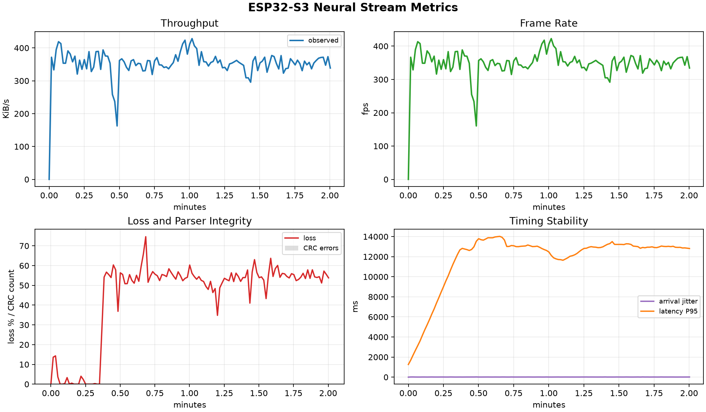
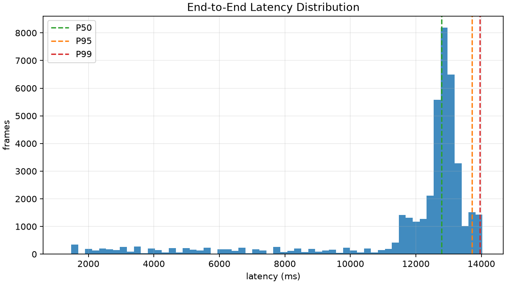

# ESP32-S3 Neural Stream Bandwidth Experiment Report

Generated at: `2026-08-12T05:27:31.877749+00:00`

## Experiment Context

This report summarizes an ESP32-S3 WiFi/UDP stream used as a neural-data surrogate for downstream spike-sorting and compression experiments. The main engineering question is how much packetized throughput the wireless link can sustain while keeping sequence-gap loss, CRC errors, jitter, and end-to-end latency within an acceptable range.

## Key Results

| Metric | Value |
| --- | ---: |
| Time filter | all data |
| Capture start UTC | 2026-08-12T05:21:54.324127+00:00 |
| Capture end UTC | 2026-08-12T05:23:54.483746+00:00 |
| Captured frames | 42103 |
| Capture duration | 120.16 s |
| Transport | udp |
| Payload bytes | 1024 |
| Frame bytes | 1038 |
| Target FPS | unlimited |
| Target throughput | n/a |
| Mean FPS | 347.50 |
| FPS range | 0.00 - 422.61 |
| Mean throughput | 352.25 KiB/s |
| Throughput range | 0.00 - 428.39 KiB/s |
| Total missing frames by sequence | 41752 |
| Missing frames by in-window gaps | 41752 |
| Longest consecutive missing run | 214 |
| Window missing-frame sum | 41752 |
| Mean loss rate | 44.5098% |
| Max loss rate | 74.6315% |
| CRC/resync errors | 0 |
| Old/duplicate frames | 0 |
| Mean arrival jitter | 10.032 ms |
| Max arrival jitter | 16.092 ms |
| Mean bandwidth volatility | 51.160 KiB/s |
| Max bandwidth volatility | 262.839 KiB/s |
| Latency samples | 42103 |
| Mean latency | 11720.688 ms |
| P50 latency | 12788.854 ms |
| P95 latency | 13713.820 ms |
| P99 latency | 13957.384 ms |

## Quality Gates

| Gate | Status | Value | Criterion |
| --- | --- | ---: | --- |
| CRC / parser integrity | PASS | 0 | crc_errors == 0 |
| Application loss | WARN | 74.6315% | max loss <= 0.1% |
| Latency availability | PASS | 42103 | SNTP latency samples present |

## Figures






## Interpretation Notes

- A healthy UDP run should keep loss rate and CRC/resync errors at zero for the current unlimited fps x 1024 byte workload.
- Arrival jitter captures UDP datagram cadence variability; sequence gaps represent application-visible packet loss rather than TCP backpressure.
- Latency is available only when the ESP32-S3 SNTP clock sync succeeds and the laptop clock is also synchronized.
- If latency is unavailable, use throughput, frame cadence, and jitter for link stability, then repeat the run with working NTP before drawing latency conclusions.
- Treat the quality gates as screening checks. A WARN does not automatically invalidate the run, but it should be explained in the experiment notes.

## Experiment Manifest

```json
{
  "application_context": {
    "workload": "spike_stream_surrogate",
    "downstream_task": "UDP maximum-throughput search for neural stream transport",
    "notes": "The ESP32-S3 sender disables FPS pacing and sends numbered 1 KiB UDP datagrams as fast as the socket path allows."
  },
  "condition": {
    "duration_min": 2,
    "purpose": "unpaced UDP maximum-throughput measurement with per-packet sequence logging"
  },
  "condition_label": "udp-max-throughput",
  "experiment_id": "udp-max-throughput-001",
  "frame_bytes": 1038,
  "network": {
    "ssid": "Dennis",
    "receiver_ip": "192.168.137.1",
    "receiver_port": 5001,
    "hotspot_device": "Windows laptop mobile hotspot"
  },
  "operator": "",
  "payload_bytes": 1024,
  "receiver_started_at_local": "2026-08-12T13:01:27",
  "started_at_local": "",
  "stream": {
    "transport": "WiFi + UDP",
    "target_fps": "unlimited",
    "payload_bytes": 1024,
    "frame_bytes": 1038,
    "nominal_rate_kib_s": null,
    "pacing": "disabled"
  },
  "target_fps": "unlimited",
  "transport": "udp",
  "udp_socket_rcvbuf": 4194304
}
```
