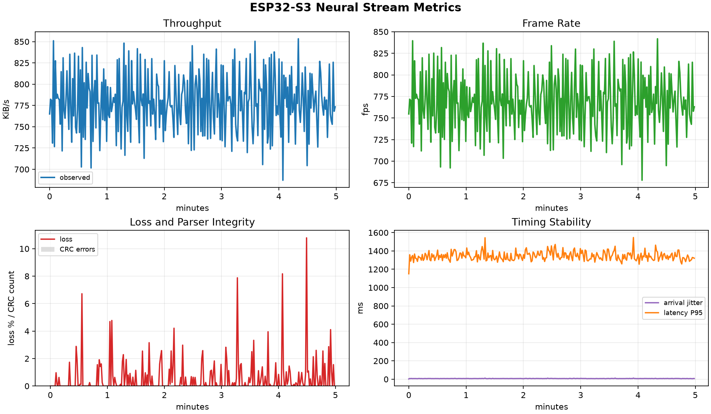
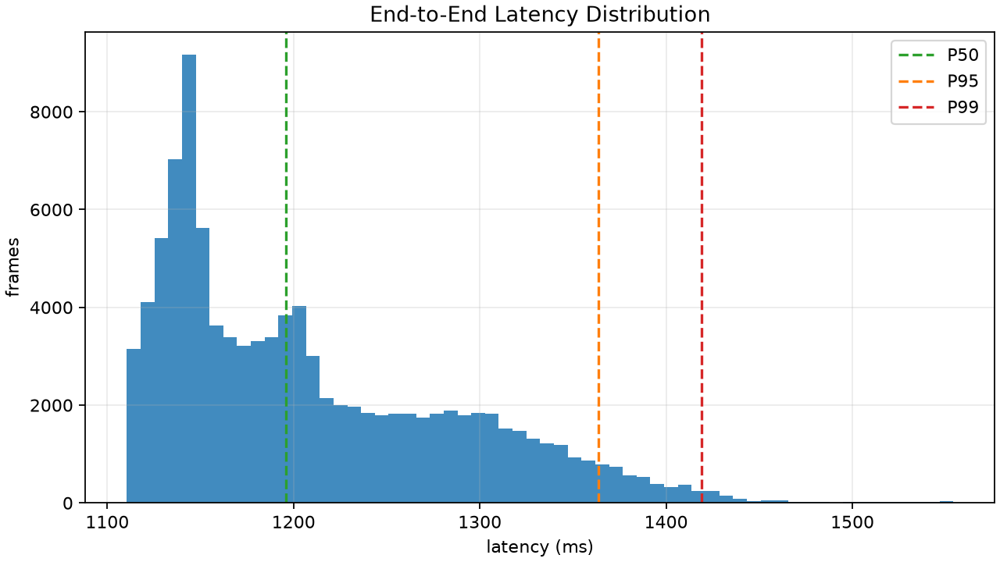

# ESP32-S3 Neural Stream Bandwidth Experiment Report

Generated at: `2026-08-12T07:23:26.954580+00:00`

## Experiment Context

This report summarizes an ESP32-S3 WiFi/UDP stream used as a neural-data surrogate for downstream spike-sorting and compression experiments. The main engineering question is how much packetized throughput the wireless link can sustain while keeping sequence-gap loss, CRC errors, jitter, and end-to-end latency within an acceptable range.

## Key Results

| Metric | Value |
| --- | ---: |
| Time filter | all data |
| Capture start UTC | 2026-08-12T07:18:26.392017+00:00 |
| Capture end UTC | 2026-08-12T07:23:26.267811+00:00 |
| Captured frames | 230462 |
| Capture duration | 299.88 s |
| Transport | udp |
| Payload bytes | 1024 |
| Frame bytes | 1038 |
| Target FPS | unlimited |
| Target throughput | n/a |
| Mean FPS | 768.72 |
| FPS range | 677.90 - 841.82 |
| Mean throughput | 779.23 KiB/s |
| Throughput range | 687.17 - 853.33 KiB/s |
| Total missing frames by sequence | 1384 |
| Missing frames by in-window gaps | 1384 |
| Longest consecutive missing run | 42 |
| Window missing-frame sum | 1384 |
| Mean loss rate | 0.5949% |
| Max loss rate | 10.7905% |
| CRC/resync errors | 0 |
| Old/duplicate frames | 0 |
| Mean arrival jitter | 7.259 ms |
| Max arrival jitter | 11.888 ms |
| Mean bandwidth volatility | 35.140 KiB/s |
| Max bandwidth volatility | 46.171 KiB/s |
| Latency samples | 230462 |
| Mean latency | 1214.374 ms |
| P50 latency | 1195.769 ms |
| P95 latency | 1363.725 ms |
| P99 latency | 1419.148 ms |

## Quality Gates

| Gate | Status | Value | Criterion |
| --- | --- | ---: | --- |
| CRC / parser integrity | PASS | 0 | crc_errors == 0 |
| Application loss | WARN | 10.7905% | max loss <= 0.1% |
| Latency availability | PASS | 230462 | SNTP latency samples present |

## Figures






## Interpretation Notes

- A healthy UDP run should keep loss rate and CRC/resync errors at zero for the current unlimited fps x 1024 byte workload.
- Arrival jitter captures UDP datagram cadence variability; sequence gaps represent application-visible packet loss rather than TCP backpressure.
- Latency is available only when the ESP32-S3 SNTP clock sync succeeds and the laptop clock is also synchronized.
- If latency is unavailable, use throughput, frame cadence, and jitter for link stability, then repeat the run with working NTP before drawing latency conclusions.
- Treat the quality gates as screening checks. A WARN does not automatically invalidate the run, but it should be explained in the experiment notes.

## Experiment Manifest

```json
{
  "application_context": {
    "workload": "spike_stream_surrogate",
    "downstream_task": "UDP maximum-throughput search for neural stream transport",
    "notes": "The ESP32-S3 sender disables FPS pacing and sends numbered 1 KiB UDP datagrams as fast as the socket path allows."
  },
  "condition": {
    "duration_min": 2,
    "purpose": "unpaced UDP maximum-throughput measurement with per-packet sequence logging"
  },
  "condition_label": "udp-max-throughput",
  "experiment_id": "udp-max-throughput-001",
  "frame_bytes": 1038,
  "network": {
    "ssid": "Dennis",
    "receiver_ip": "192.168.137.1",
    "receiver_port": 5001,
    "hotspot_device": "Windows laptop mobile hotspot"
  },
  "operator": "",
  "payload_bytes": 1024,
  "receiver_started_at_local": "2026-08-12T15:18:25",
  "started_at_local": "",
  "stream": {
    "transport": "WiFi + UDP",
    "target_fps": "unlimited",
    "payload_bytes": 1024,
    "frame_bytes": 1038,
    "nominal_rate_kib_s": null,
    "pacing": "disabled"
  },
  "target_fps": "unlimited",
  "transport": "udp",
  "udp_socket_rcvbuf": 4194304
}
```
