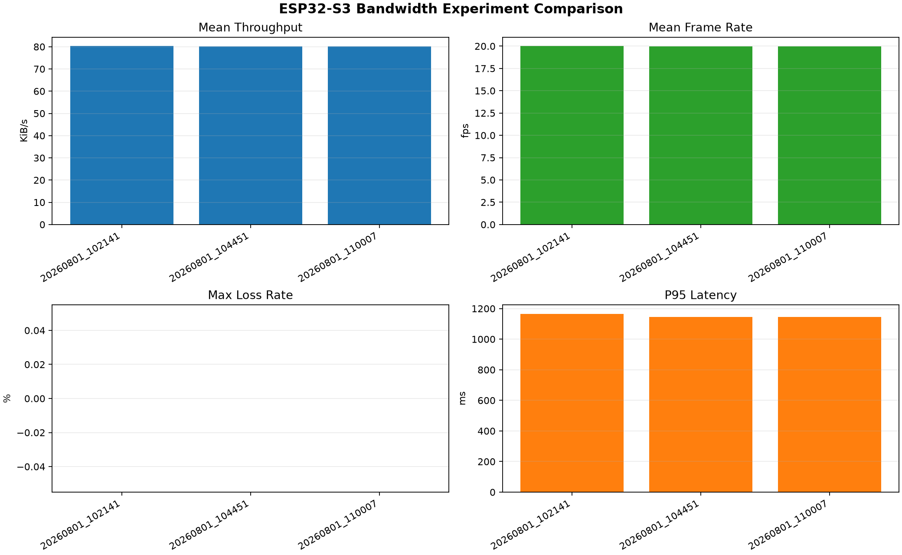
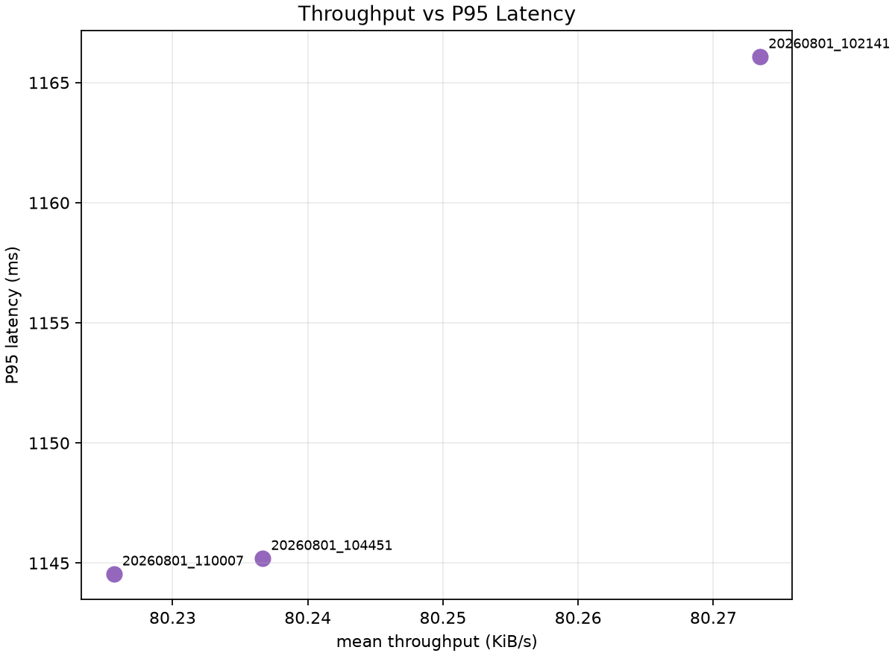

# ESP32-S3 Bandwidth Experiment Comparison

Combined CSV: `comparison_summary_20260801_110024.csv`

| Run | Mean throughput KiB/s | Mean FPS | Max loss rate | CRC errors | Mean jitter ms | P95 latency ms |
| --- | ---: | ---: | ---: | ---: | ---: | ---: |
| 20260801_102141 | 80.27346225572309 | 20.000006167849254 | 0.0 | 0 | 51.48996591880597 | 1166.08817 |
| 20260801_104451 | 80.23666188048605 | 19.99083741255906 | 0.0 | 0 | 50.112980008226394 | 1145.200925 |
| 20260801_110007 | 80.22565754712878 | 19.988095700306538 | 0.0 | 0 | 49.73980091644258 | 1144.55512 |

## Figures

