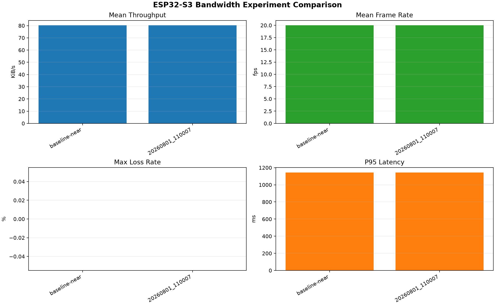
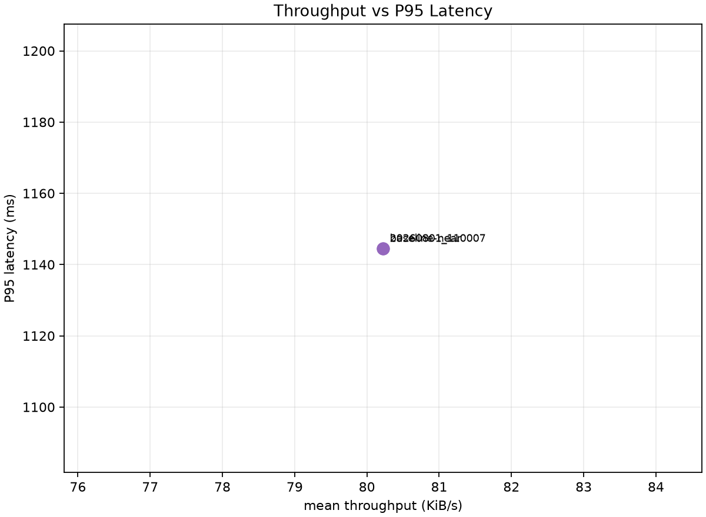

# ESP32-S3 Bandwidth Experiment Comparison

Combined CSV: `comparison_summary_20260801_110124.csv`

| Run | Mean throughput KiB/s | Mean FPS | Max loss rate | CRC errors | Mean jitter ms | P95 latency ms |
| --- | ---: | ---: | ---: | ---: | ---: | ---: |
| baseline-near | 80.22565754712878 | 19.988095700306538 | 0.0 | 0 | 49.73980091644258 | 1144.55512 |
| 20260801_110007 | 80.22565754712878 | 19.988095700306538 | 0.0 | 0 | 49.73980091644258 | 1144.55512 |

## Figures

