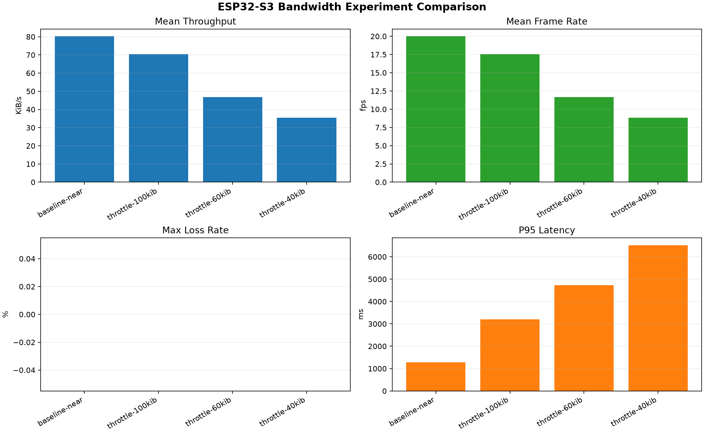
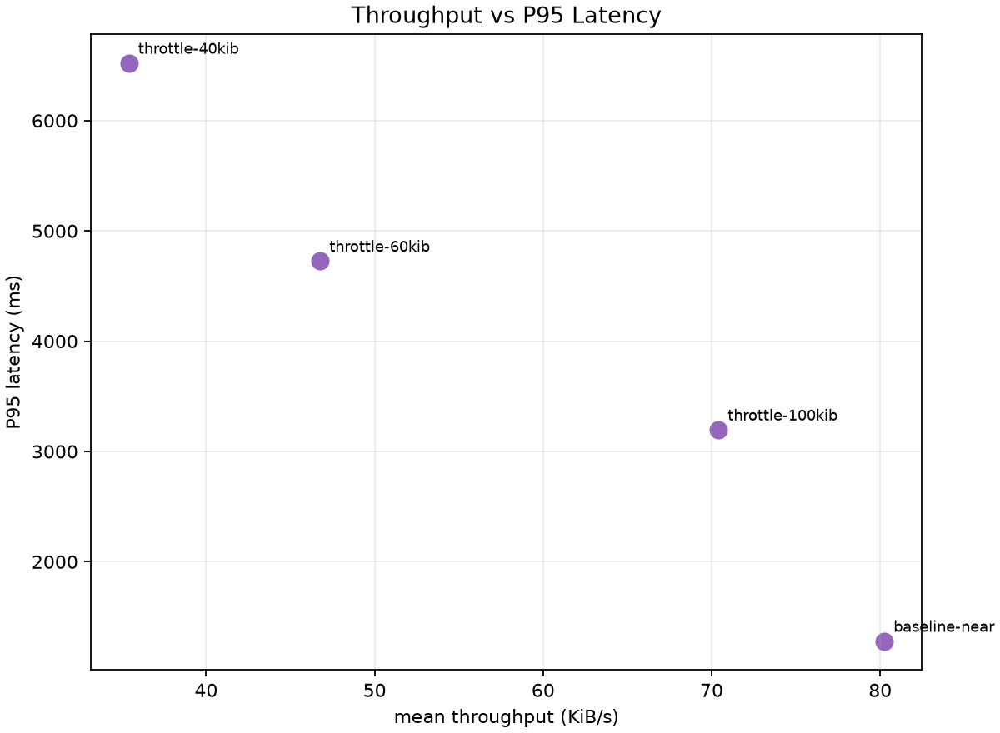

# ESP32-S3 Bandwidth Experiment Comparison

Combined CSV: `comparison_summary_20260801_110814.csv`

| Run | Mean throughput KiB/s | Mean FPS | Max loss rate | CRC errors | Mean jitter ms | P95 latency ms |
| --- | ---: | ---: | ---: | ---: | ---: | ---: |
| baseline-near | 80.23929822761235 | 19.99149425427617 | 0.0 | 0 | 51.124167883167644 | 1280.27338 |
| throttle-100kib | 70.40385787388196 | 17.541009844976916 | 0.0 | 0 | 153.6178958277178 | 3196.4189699999997 |
| throttle-60kib | 46.761890326010494 | 11.65065102039775 | 0.0 | 0 | 221.4824790098446 | 4727.93466 |
| throttle-40kib | 35.41542331967218 | 8.82369671030275 | 0.0 | 0 | 244.818739441587 | 6522.090155 |

## Figures

