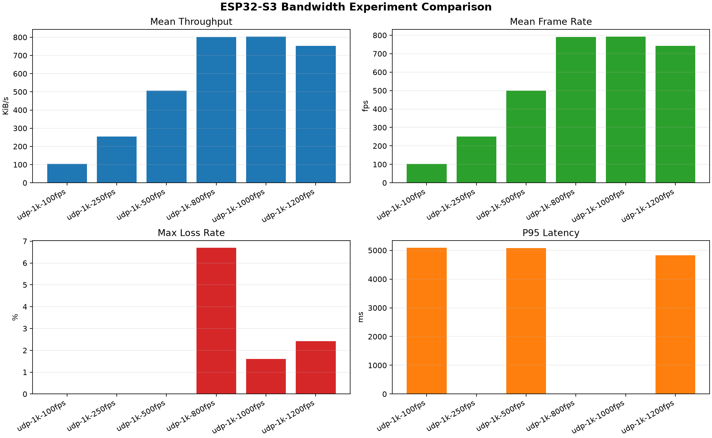
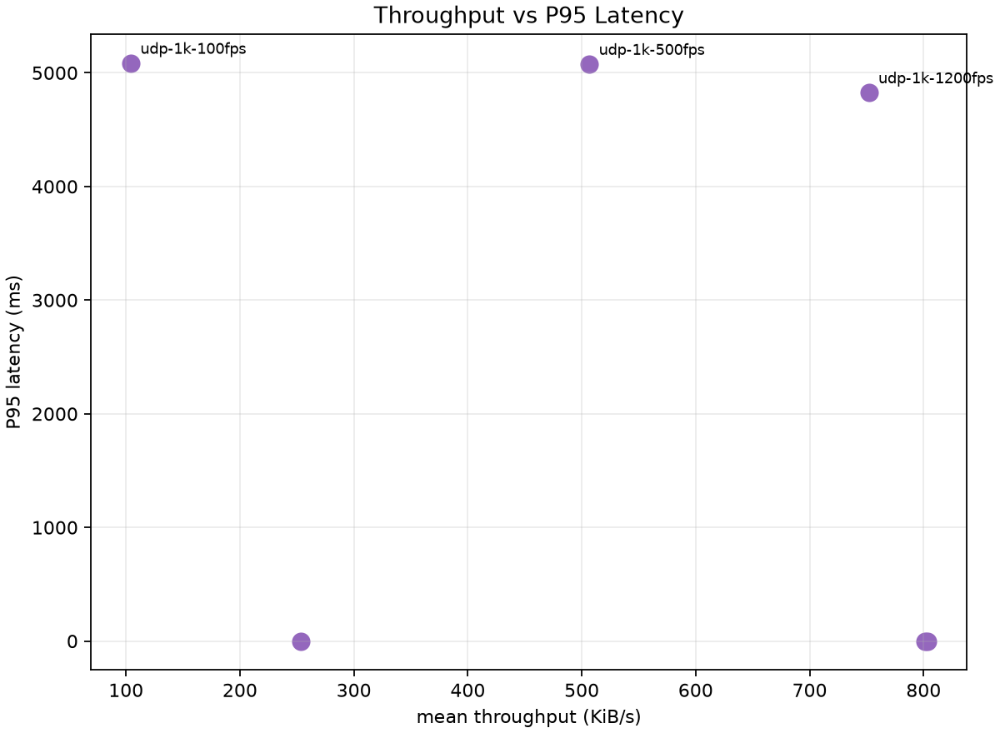

# ESP32-S3 Bandwidth Experiment Comparison

Combined CSV: `comparison_summary_20260811_001025.csv`

| Run | Transport | Payload bytes | Mean throughput KiB/s | Mean FPS | Max loss rate | CRC errors | Mean jitter ms | P95 latency ms |
| --- | --- | ---: | ---: | ---: | ---: | ---: | ---: | ---: |
| udp-1k-100fps | udp | 1024 | 104.40001509903223 | 102.99192240983525 | 0.0 | 0 | 20.24196975568607 | 5085.842900000001 |
| udp-1k-250fps | udp | 1024 | 253.42019841361505 | 250.00219959108074 | 0.0 | 0 | 11.189391414143302 |  |
| udp-1k-500fps | udp | 1024 | 506.840079342548 | 500.00408597954635 | 0.0 | 0 | 8.11525150763689 | 5076.60525 |
| udp-1k-800fps | udp | 1024 | 801.5392880270789 | 790.7285461847099 | 0.06691449814126393 | 0 | 6.832471326129507 |  |
| udp-1k-1000fps | udp | 1024 | 803.0833722039698 | 792.2518045634538 | 0.01600985221674877 | 0 | 6.422845726244335 |  |
| udp-1k-1200fps | udp | 1024 | 752.1359579620282 | 741.9915423440432 | 0.024226110363391656 | 0 | 7.025084479690143 | 4826.340410000001 |

## Figures

